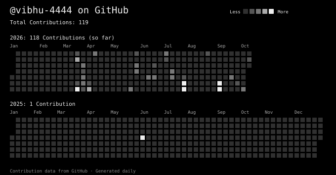

<div align="center">
  
  <h1>Ojaswi Kashtheriya</h1>
  <p><strong>BCA (Artificial Intelligence &amp; Machine Learning) · Frontend Developer</strong></p>
  <p>
    <a href="mailto:ojaswikasteriya@gmail.com">Email</a> ·
    <a href="https://www.linkedin.com/in/ojaswi-kashtheriya">LinkedIn</a> ·
    <a href="https://github.com/vibhu-4444">GitHub</a>
  </p>
  
</div>

---

## `~/ whoami`

```text
BCA student in Artificial Intelligence and Machine Learning at Haridwar University.
Frontend developer with experience building React interfaces, REST API integrations, and MERN features.
Expected graduation: June 2028 · Aggregate: 73%
```

## `~/ experience`

### Frontend Developer Intern · College ERP System
**Haridwar University · Remote · Feb 2026 - Present**

- Built reusable React components with Tailwind CSS and integrated them with REST APIs.
- Improved responsive layouts and cross-device usability.

### MERN Stack Intern
**Maincrafts Technology · Remote · Mar 2026 - Apr 2026**

- Built full-stack MERN features and REST APIs connected to React frontends.
- Worked with senior developers to debug, test, and deploy application features.

## `~/ technical skills`

<div align="center">
  
</div>

- **Languages:** JavaScript, TypeScript, Python
- **Frontend:** React.js, Next.js, HTML5, CSS3, Tailwind CSS, Radix UI, Framer Motion
- **Backend &amp; data:** Node.js, Express.js, PostgreSQL, MongoDB, Prisma ORM
- **Tools:** Git, GitHub, Vite, Vitest, Playwright, Docker, REST APIs

## `~/ selected projects`

### [REVIVE · Revenue Recovery &amp; Payment Operations Platform](https://github.com/vibhu-4444/REVIVE-Revenue-Recovery-Payment-Operations-Platform)
**React · TypeScript · Vite · Tailwind CSS · Vitest**

Built a domain-driven payment operations platform with reusable components across 15 dashboard views. Added a configurable policy engine, recovery recommendations, provider integrations, and unit and integration tests.

### [VaultIQ · Personal Finance Dashboard](https://github.com/vibhu-4444/VaultIQ)
**Next.js · TypeScript · Prisma · NextAuth · Zustand · Recharts**

Built a personal finance dashboard and reusable UI library. Added authentication, protected routes, state management, and data visualizations.

### [Synthetica · AI Research Workspace](https://github.com/vibhu-4444/Zorvia-LM)
**Next.js · TypeScript · Radix UI · TanStack Query · Zustand · Framer Motion**

Developed a three-panel research workspace with chat, notes, and studio views, plus document ingestion, retrieval, and citation-grounded chat.

### [Aurora · Music Platform](https://github.com/vibhu-4444/Aurora-Music)
**React · TypeScript · Next.js · Playwright · Docker**

Architected a TypeScript monorepo with web, API, and worker apps. Built music player and vault components with a background audio extraction worker.

## `~/ github analytics`

<div align="center">
  
  
</div>
<div align="center">
  
  <a href="https://github.com/vibhu-4444/REVIVE-Revenue-Recovery-Payment-Operations-Platform"></a>
</div>

## `~/ contributions`

<div align="center">
  
</div>

## `~/ recognition`

### Google Student Ambassador · Google India
**Apr 2026 - Present**

Selected to represent Google's developer community on campus, organize technical workshops, and promote developer programs.

<div align="center">
  
  <sub>Built with Markdown, SVG, and curiosity.</sub>
</div>
