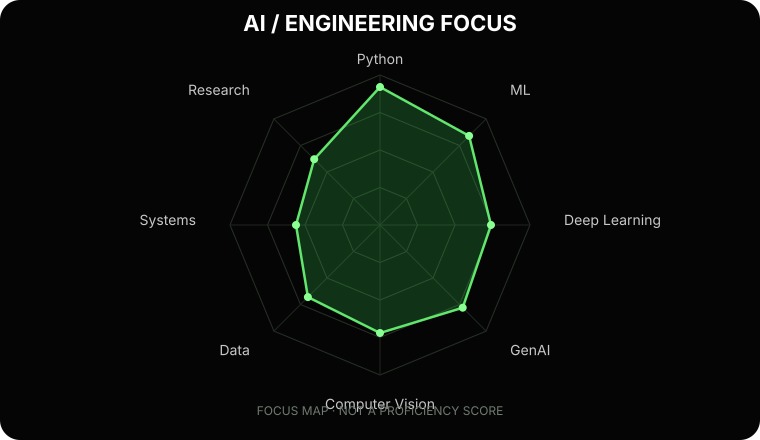
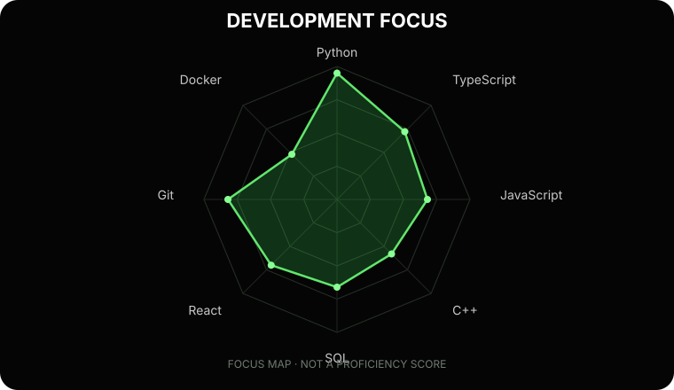
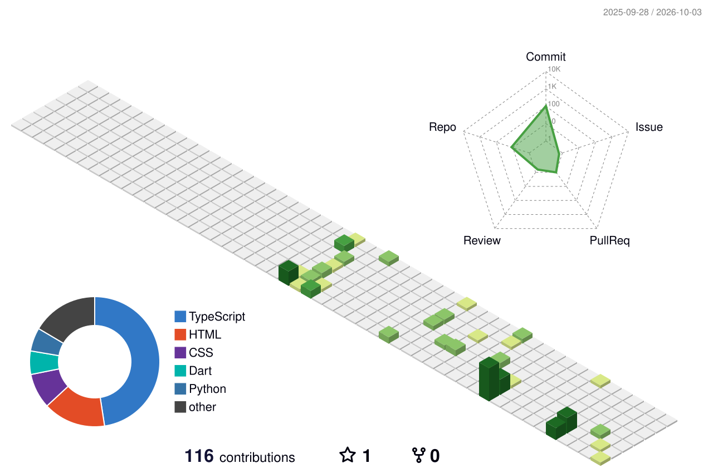

<div align="center">
  
  <h1>Ojaswi Kashtheriya</h1>
  <p><strong>BCA · Artificial Intelligence &amp; Machine Learning · Second year</strong></p>
  <p>Building practical AI/ML projects and learning by shipping.</p>
  <p>
    <a href="https://github.com/vibhu-4444"></a>
    
  </p>
</div>

---

## `~/ whoami`

```text
$ cat about.txt

Hi, I'm Ojaswi, a second-year BCA student focused on Artificial Intelligence and Machine Learning.
I enjoy exploring computer vision, generative AI, data, and full-stack AI products.

Based in India.
Learning by building useful software, one project at a time.
```

## `~/ toolbox`

<div align="center">
  <p><strong>Languages &amp; data</strong></p>
  
  <p><strong>AI / ML</strong></p>
  
  <p><strong>Web &amp; tools</strong></p>
  
</div>

## `~/ focus maps`

These custom radars show areas I’m exploring and building in. Their shapes are illustrative and do not represent measured proficiency.

<div align="center">
  
  
</div>

## `~/ github analytics`

<div align="center">
  
  
</div>
<div align="center">
  
  <a href="https://github.com/vibhu-4444/Brakshaa"></a>
</div>

## `~/ projects`

### [Brakshaa — AI-powered smart farming ecosystem](https://github.com/vibhu-4444/Brakshaa)

Project direction: plant disease detection, crop recommendations, smart reminders, and agricultural decision support.

### [Hybrid AI-NWP multi-model forecast blending](https://github.com/vibhu-4444/Hybrid-ai-nwp-forecast-blending)

Exploring AI/ML with Numerical Weather Prediction and multi-model forecast fusion.

### [Geospatial AI dashboard](https://github.com/vibhu-4444/Map-Project)

Full-stack geospatial visualization with machine-learning integration.

## `~/ contribution universe`

<div align="center">
  
</div>

## `~/ contribution snake`

<div align="center">
  <picture>
    <source media="(prefers-color-scheme: dark)" srcset="https://raw.githubusercontent.com/vibhu-4444/vibhu-4444/output/github-snake-dark.svg" />
    <source media="(prefers-color-scheme: light)" srcset="https://raw.githubusercontent.com/vibhu-4444/vibhu-4444/output/github-snake.svg" />
    
  </picture>
</div>

## `~/ currently`

```text
Learning: machine learning · deep learning · generative AI · computer vision
Building: practical AI/ML and full-stack project ideas
```

<div align="center">
  
  <sub>Built with Markdown, SVG, and curiosity.</sub>
</div>
